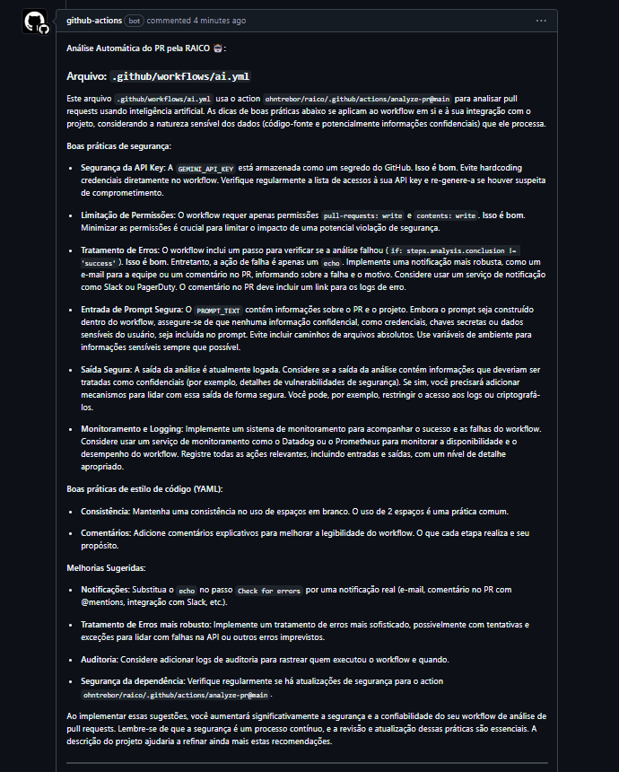

## 🦾 RAICO (Review with Artificial Intelligence for Code Orchestration)

## **Repositório Exclusivo de Integração com IA para assitência em fluxos de trabalho, em especial o GitubAction**

O **RAICO** é um repositório focado em AI, que fornece integração simples entre repositórios terceiros para revisar Pull Requests (PRs). Ele utiliza o poder da AI para:

- Analisar alterações de código.
- Verificar a aderência às melhores práticas.
- Identificar possíveis bugs.
- Sugerir melhorias.

Este repositório foi projetado para ser **reutilizável** por qualquer outro repositório. Basta configurar alguns parâmetros, como a **chave da AI** e o **prompt personalizado**, para obter análises automatizadas e inteligentes dos seus PRs.

---

## **🎯 Objetivo**

1. **Centralização**:
   - Fornecer uma solução única de IA para revisar PRs em múltiplos repositórios.
2. **Reutilização**:
   - A lógica de revisão está configurada como uma **GitHub Action Reutilizável**.
3. **Análise Inteligente**:
   - Utilizar modelos como por exemplo o **`gpt-3.5-turbo`** da OPENAI para analisar Pull Requests, detectar possíveis problemas e sugerir melhorias.

---

## **ℹ️ Como Funciona**

1. Repositórios externos referenciam este repositório como uma **GitHub Action**.
2. Durante a execução do pipeline:
   - Captura as alterações do Pull Request.
   - Processa as alterações usando a AI de preferência.
   - Adiciona comentários automáticos no Pull Request com feedback detalhado Ccom base no prompt passado.

---

## **🤖 Como Usar**
➡️ Para revisar seu PR com IA, basta APENAS copiar e colar código yml abaixo no seu arquivo yml (do seu repositório 😁) -> .github\workflows\meu-pipeline.yml

```yaml
name: Review Pull Request

on:
  pull_request:
    types: [opened, synchronize]

permissions:
  pull-requests: write
  contents: write

env:
  AI_PROVIDER: "gemini"
  AI_MODEL: "gemini-1.5-flash-latest"
  AI_VERSION: "v1beta"
  PROMPT: "Com base nas alterações realizadas no meu PR, gostaria de obter recomendações específicas sobre boas práticas de segurança e estilo de código, considerando que este projeto é um [descrição do projeto]. Por favor, analise as do meu PR e forneça sugestões práticas e contextualizadas para melhorar a qualidade do código, garantindo alinhamento com padrões de segurança e consistência com as melhores práticas do mercado."

jobs:
  raico-review-pr:
    runs-on: ubuntu-latest

    steps:

      - name: 🤖 Run Pull Request Review
        uses: ohntrebor/raico/.github/actions/review-pr@main
        with:
          ai_provider: ${{ env.AI_PROVIDER }} # No exemplo foi definida no pipe, mas pode cadastrar no seu repositório se preferir
          ai_api_key: ${{ secrets.GEMINI_API_KEY }} # Cadastrar a API_KEY no secrests do seu repositório
          ai_model: ${{ env.AI_MODEL }} # No exemplo foi definida no pipe, mas pode cadastrar no seu repositório se preferir
          ai_version: ${{ env.AI_VERSION }} # (opcional) dependendo da AI será solicitado uma versão
          github_token: ${{ secrets.GITHUB_TOKEN }} # O Github gere automático em pipelines, não precisa gerar
         # prompt: ${{ env.PROMPT }} # (opcional) Caso não defina um prompt aqui, será considerado o prompt default do repositório RAICO

```

## 🐈‍⬛ Após a configuração, dando sucesso ou erro, as sugestões da IA aparecerão como comentários do seu PR, facilitando assim a leitura




<br><br>

<hr>


## 🖥️ Caso queira clonar o repositório em sua máquina e rodar localmente, siga o passa a passo logo abaixo:


## **📄 Estrutura Necessária do `.env`**

Certifique-se de configurar o arquivo `.env` com as seguintes variáveis no ambiente onde o script será executado, caso deseje clonar o repo e testar local:

```plaintext
  AI_PROVIDER: "gemini"
  AI_API_KEY: "xxxxxxxxxxxxxxxxxxxxxx"
  AI_MODEL: "gemini-1.5-flash-latest"
  AI_VERSION: "v1beta"
  GITHUB_REPOSITORY: "github.com/seu-github/seu-repo"
  GITHUB_TOKEN: "seu github token"
  PR_NUMBER: "7" // Número do PR que você quer revisar (do seu repo)
  PROMPT_PATH: "scripts/prompts/default_prompt.txt" // mantenha esse path, e altere o prompt a partir desse arquivo
```

## 📖 Passo a Passo para Instalar e Rodar o Projeto

### **1. Clone o Repositório**

```bash
git clone https://github.com/ohntrebor/raico.git
cd raico
```

### **2. Configure o Ambiente Virtual**

```bash
python -m venv venv
source venv/bin/activate  # No Windows: venv\Scripts\activate
```

### **3. Instale as Dependências**

```bash
pip install -r scripts/requirements.txt
```

### **4. Testar**

```bash
pytest -m gemini # exemplo, rodando Gemini
pytest -m openai # exemplo, rodando Chat-GPT
```